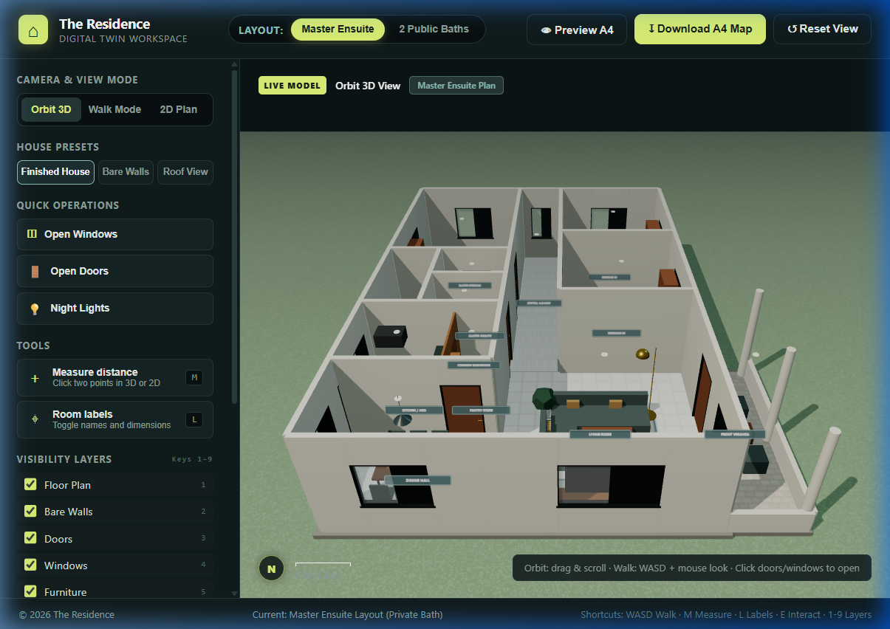
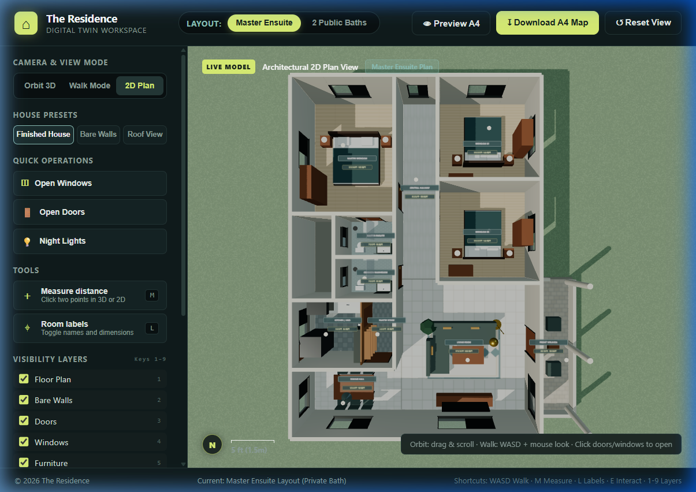
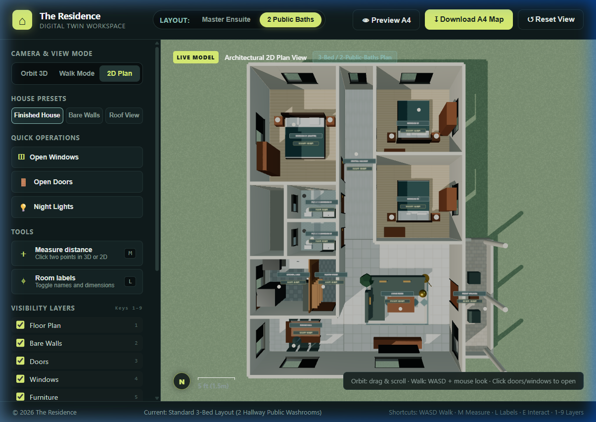
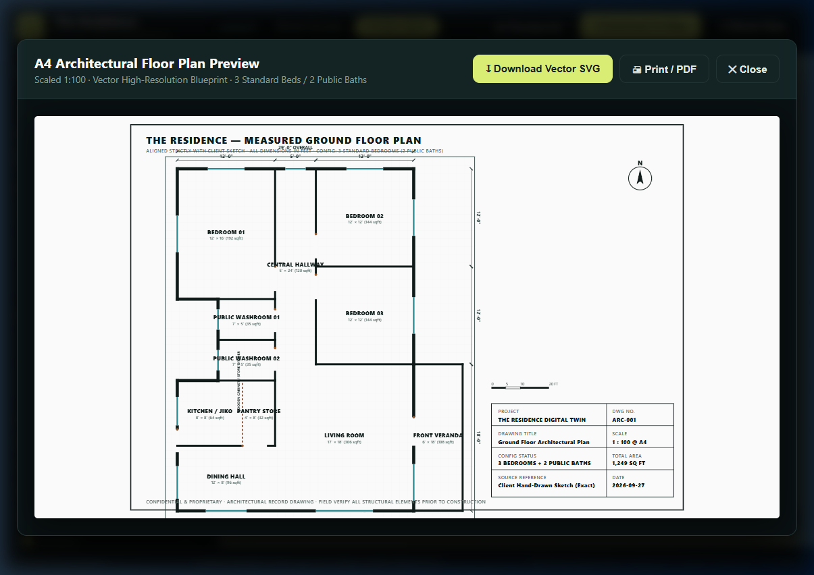

# 🏡 The Residence - Digital Twin



A fully interactive 3D digital twin of a residential property built with **Three.js** and **Vite**. This application brings floor plans to life with dynamic architecture, responsive design, and in-browser blueprint generation.

## ✨ Features

- **Interactive 3D Digital Twin**: Fully realized 3D architecture based on precise dimensions. Walk around, orbit the house, and inspect details.
- **Dynamic Layouts**: Toggle between **Master Ensuite** (Private Bath) and **2 Public Baths** modes seamlessly. Geometry and doors update instantly.
- **Blueprint Mode (2D Plan)**: View an orthographic floor plan of the property.
- **Printable A4 Blueprints**: Generate professional SVGs with custom layout titles, room labels, and measurement grids directly in your browser.
- **Responsive UI Dashboard**: Sleek, glassmorphism-inspired interface with responsive mobile drawer controls. 
- **Interactive Elements**: Open and close windows and doors, toggle layers, switch to night mode lighting, and measure distances dynamically.

---

## 📸 Gallery

### 2D Plan View


### Public Baths Layout Mode


### A4 Blueprint Generator


---

## 🛠️ Tech Stack

- **Core**: HTML5, CSS3, JavaScript (ES6+)
- **3D Engine**: [Three.js](https://threejs.org/)
- **Build Tool**: [Vite](https://vitejs.dev/)

## 🚀 Getting Started

1. **Clone the repository:**
   ```bash
   git clone https://github.com/The-Agaba/the_residence.git
   cd the_residence
   ```

2. **Install dependencies:**
   ```bash
   npm install
   ```

3. **Run the development server:**
   ```bash
   npm run dev
   ```
   *The application will typically be available at `http://localhost:5173`.*

4. **Build for production:**
   ```bash
   npm run build
   ```

## 🎮 Controls

- **Orbit Mode**: Left-click and drag to rotate, right-click to pan, scroll to zoom.
- **Walk Mode**: Use `W A S D` to move around and mouse to look.
- **Interact**: Click on any door or window to open/close it.
- **Shortcuts**:
  - `M`: Toggle measurement tool (click two points).
  - `L`: Toggle room labels.
  - `1-9`: Toggle visibility layers (e.g., walls, furniture, roof).

---
*Created as an interactive architectural visualization project.*
